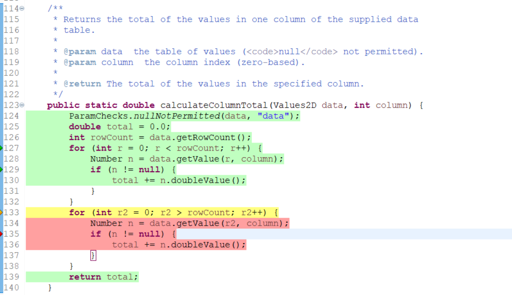
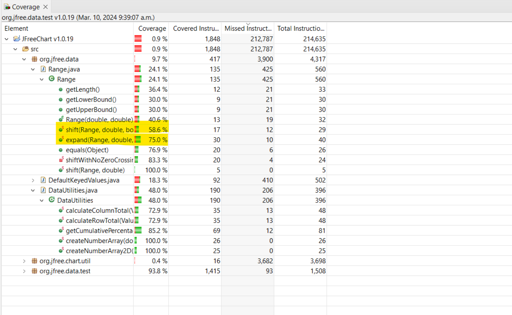

**SENG 637 - Dependability and Reliability of Software Systems**

**Lab. Report #3 – Code Coverage, Adequacy Criteria and Test Case Correlation**

| Group Number 19      |
| -------------- |
| Sami Abdelhalem |
| Mohammad Hallaq |
| Ogechukwu Kanu |
| Emmanuel Alafonye |

**Table of Content**

[1 Introduction](https://github.com/seng637-Winter/seng637-a3-AllisonOge/blob/main/seng637-a3-team_number.md#1-introduction)

[2 Manual data-flow coverage calculations for `DataUtilities.calculateColumnTotal` and `Range.expand` methods](https://github.com/seng637-Winter/seng637-a3-AllisonOge/blob/main/seng637-a3-team_number.md#2-manual-data-flow-coverage-calculations-for-datautilitiescalculatecolumntotal-and-rangeexpand-methods)

[3 A detailed description of the testing strategy for the new unit test](https://github.com/seng637-Winter/seng637-a3-AllisonOge/blob/main/seng637-a3-team_number.md#3-a-detailed-description-of-the-testing-strategy-for-the-new-unit-test)

[4 A high-level description of five selected test cases you have designed using coverage information, and how they have increased code coverage](https://github.com/seng637-Winter/seng637-a3-AllisonOge/blob/main/seng637-a3-team_number.md#4-a-high-level-description-of-five-selected-test-cases-you-have-designed-using-coverage-information-and-how-they-have-increased-code-coverage)

[5 A detailed report of the coverage achieved of each class and method](https://github.com/seng637-Winter/seng637-a3-AllisonOge/blob/main/seng637-a3-team_number.md#5-a-detailed-report-of-the-coverage-achieved-of-each-class-and-method)

[6 Pros and Cons of coverage tools used and Metrics you report](https://github.com/seng637-Winter/seng637-a3-AllisonOge/blob/main/seng637-a3-team_number.md#6-pros-and-cons-of-coverage-tools-used-and-metrics-you-report)

[7 A comparison of the advantages and disadvantages of requirements-based test generation and coverage-based test generation.](https://github.com/seng637-Winter/seng637-a3-AllisonOge/blob/main/seng637-a3-team_number.md#7-a-comparison-of-the-advantages-and-disadvantages-of-requirements-based-test-generation-and-coverage-based-test-generation)

[8 A discussion on how the teamwork/effort was divided and managed](https://github.com/seng637-Winter/seng637-a3-AllisonOge/blob/main/seng637-a3-team_number.md#8-a-discussion-on-how-the-teamworkeffort-was-divided-and-managed)

[9 Any difficulties encountered, challenges overcome, and lessons learned from performing the lab](https://github.com/seng637-Winter/seng637-a3-AllisonOge/blob/main/seng637-a3-team_number.md#9-any-difficulties-encountered-challenges-overcome-and-lessons-learned-from-performing-the-lab)

[10 Comments/feedback on the lab itself](https://github.com/seng637-Winter/seng637-a3-AllisonOge/blob/main/seng637-a3-team_number.md#10-commentsfeedback-on-the-lab-itself)

# 1 Introduction

In this lab report, we discuss the analysis of the developed test suite from the previous lab using the code coverage tool EclEmma and how the test suite is improved for better code coverage. This was done by first familiarizing ourselves with the assignment instructions and understanding the required tasks to be completed. 

In the following sections, we will manually compute the data-flow coverage for two methods, `DataUtilities.calculateColumnTotal` and `Range.expand`, devise a test strategy to improve the code coverage of the existing test suite, give a high-level overview of five of the test cases that were added, analyse the code coverage across the two classes (`DataUtilities` and `Range`) and their methods (all ten of them) with the improved test suite while stating any pros and cons observed. Then we compare the black box and white box testing techniques as employed in the labs, how the work was distributed among the team and the challenges and solutions used.

# 2 Manual data-flow coverage calculations for DataUtilities.calculateColumnTotal and Range.expand methods

The data-flow coverage calculation for DataUtilities.calculateColumnTotal method is as follows. We first developed the data flow graph below and determined the Def-Use table to determine the data-flow coverage corresponding to that computed by the EclEmma library for the test cases developed during the black-box testing lab.

*Data Flow graph for the `DataUtilities.calculateColumnTotal` method*

*`DataUtilities.calculateColumnTotal` method code*

From the DFG shown, we developed the Def-Use table as follows
| Variable (v) | Definition at node (n) | Use at node (n) |
| --- | --- | --- |
| data | 123 | 124, 126, 128, 134 |
| column | 123 | 128, 134 |
| total | 125 | 130, 136, 139 |
| rowCount | 126 | 127, 133 |
| r | 127 | 127 |
| r2 | 133 | 133 |
| n | 128 | 129, 130 |
| n | 134 | 135, 136 |

The Def-Use sets for the variables are as follows.

For variable `data`: {(123, 124), (123, 126), (123, 128), (123, 134)} (4 pairs) 
For variable `column`: {(123, 128), (123, 134)} (2 pairs) 
For variable `total`: {(125, 130), (125, 136), (125, 139)} (3 pairs) 
For variable `rowCount`: {(126, 127), (126, 133)} (2 pairs) 
For variable `r`: {(127, 127)} (1 pair) 
For variable `r2`: {(133, 133)} (1 pair) 
For variable `n`: {(128, 129), (128, 130), (134, 135), (134, 136)} (4 pairs)

Thus, the total Def-Use pairs is 17 pairs.

The test cases developed from the black-box testing lab are summarized in the following decision table.
| Test Cases | Data Null | Column index | Expected Outcome |
| --- | --- | --- | --- |
| 1 | No | Valid (1) | The sum of the column (10.0) |
| 2 | No | Out-of-bounds (-1) | 0 |
| 3 | Yes | Any (0) | InvalidParameterException |

Considering each test case, we will determine the Def-Use pairs covered 
**TC1**:
The test case sets the arguments of the method as follows: 
>int column = 1 
Values2D data = 2X2 (mock data) 

The following Def-Use coverage is reached.

For variable `data`: {(123, 124), (123, 126), (123, 128)} (3 pairs) 
For variable `column`: {(123, 128)} (1 pair) 
For variable `total`: {(125, 130), (125, 139)} (2 pairs) 
For variable `rowCount`: {(126, 127), (126, 133)} (2 pairs) 
For variable `r`: {(127, 127)} (1 pair) 
For variable `r2`: {(133, 133)} (1 pair) 
For variable `n`: {(128, 129), (128, 130)} (2 pairs)

This gives a total DU-pair coverage of 12 pairs.

**TC2**:
The test case sets the arguments of the method as follows: 
>int column = -1 
Values2D data = 3X1 (mock data)

The following Def-Use coverage is reached.

For variable `data`: {(123, 124), (123, 126), (123, 128)} (3 pairs) 
For variable `column`: {(123, 128)} (1 pair) 
For variable `total`: {(125, 130), (125, 139)} (2 pairs) 
For variable `rowCount`: {(126, 127), (126, 133)} (2 pairs) 
For variable `r`: {(127, 127)} (1 pair) 
For variable `r2`: {(133, 133)} (1 pair) 
For variable `n`: {(128, 129), (128, 130)} (2 pairs) 

This also gives a total DU-pair coverage of 12 pairs.

**TC3**:
The test case sets the arguments of the method as follows: 
>int column = 0 
Values2D data = null

The following Def-Use coverage is reached.

For variable `data`: {(123, 124)} (1 pair)

The DU-pair coverage for this test is 1 pair.

Considering all the test cases and the total coverage we have 12 pairs. We can now compute the data-flow coverage as **`total DU pairs covered / total DU pairs = 12/17 = 0.706 or 70.6%`**.

The data-flow coverage calculation for the `Range.expand` method is as follows. We take similar steps as above with the `DataUtilities.calculateColumnTotal` method to compute the data-flow coverage. Thus the developed DFG is as shown.

*Data Flow graph for the `Range.expand` method*

*`Range.expand` method code*

From the DFG shown, we developed the Def-Use table as follows
| Variable (v) | Definition at node (n) | Use at node (n) |
| --- | --- | --- |
| range | 349 | 351, 352, 353, 354 |
| lowerMargin | 349 | 353 |
| upperMargin | 349 | 354 |
| length | 352 | 353, 354 |
| lower | 353 | 355, 356, 357, 359 |
| upper | 354 | 355, 356, 359 |
| upper | 357 | 359 |

The Def-Use sets for the variables are as follows.

For variable `range`: {(349, 351), (349, 352), (349, 353), (349, 354)} (4 pairs) 
For variable `lowerMargin`: {(349, 353)} (1 pair) 
For variable `upperMargin`: {(349, 354)} (1 pair) 
For variable `length`: {(352, 353), (352, 354)} (2 pairs) 
For variable `lower`: {(353, 355), (353, 356), (353, 357), (353, 359)} (4 pairs) 
For variable `upper`: {(354, 355), (354, 356), (354, 359), (357, 359)} (4 pairs) 

Thus, the total Def-Use pairs is 16 pairs.

The test cases developed from the black-box testing lab are summarized in the following decision table.
| Valid Range | Lower Margin | Upper Margin | Expected Outcome |
| --- | --- | --- | --- |
| Yes | Within 0 - 1 (0.25) | Within 0 - 1 (0.25) | Valid expansion |
| Yes (empty range) | Within 0 - 1 (0.2) | Within 0 - 1 (0.2) | Valid expansion |
| Yes | Beyond 0 - 1 (-0.25) | Beyond 0 - 1 (-0.25) | InvalidParameterException |
| No | Any (0.25) | Any (0.5) | InvalidParameterException |

Considering each test case, we will determine the Def-Use pairs covered 
**TC1**:
The test case sets the arguments of the method as follows:
>Range range = Range(2, 6) 
double lowerMargin = 0.25 
double upperMargin = 0.5

The following Def-Use coverage is reached.

For variable `range`: {(349, 351), (349, 352), (349, 353), (349, 354)} (4 pairs) 
For variable `lowerMargin`: {(349, 353)} (1 pair) 
For variable `upperMargin`: {(349, 354)} (1 pair) 
For variable `length`: {(352, 353), (352, 354)} (2 pairs) 
For variable `lower`: {(353, 355), (353, 359)} (2 pairs) 
For variable `upper`: {(354, 355), (354, 359)} (2 pairs)

This gives a total DU-pair coverage of 12 pairs.

**TC2**:
The test case sets the arguments of the method as follows:
>Range range = Range(2, 2) 
double lowerMargin = 0.2 
double upperMargin = 0.2

The following Def-Use coverage is reached.

For variable `range`: {(349, 351), (349, 352), (349, 353), (349, 354)} (4 pairs) 
For variable `lowerMargin`: {(349, 353)} (1 pair) 
For variable `upperMargin`: {(349, 354)} (1 pair) 
For variable `length`: {(352, 353), (352, 354)} (2 pairs) 
For variable `lower`: {(353, 355), (353, 359)} (2 pairs) 
For variable `upper`: {(354, 355), (354, 359)} (2 pairs)

This gives a total DU-pair coverage of 12 pairs.

**TC3**:
The test case sets the arguments of the method as follows:
>Range range = Range(2, 6) 
double lowerMargin = -0.25 
double upperMargin = -0.25

The following Def-Use coverage is reached.

For variable `range`: {(349, 351), (349, 352), (349, 353), (349, 354)} (4 pairs) 
For variable `lowerMargin`: {(349, 353)} (1 pair) 
For variable `upperMargin`: {(349, 354)} (1 pair) 
For variable `length`: {(352, 353), (352, 354)} (2 pairs) 
For variable `lower`: {(353, 355), (353, 359)} (2 pairs) 
For variable `upper`: {(354, 355), (354, 359)} (2 pairs)

This gives a total DU-pair coverage of 12 pairs.

**TC4**:
The test case sets the arguments of the method as follows:
>Range range = Range=null 
double lowerMargin = 0.25 
double upperMargin = 0.5

The following Def-Use coverage is reached.

For variable `range`: {(349, 351)} (1 pair)

This gives a total DU-pair coverage of 1 pair.

Considering all the test cases and the total coverage we have 12 pairs. We can now compute the data-flow coverage as **`total DU pairs covered / total DU pairs = 12/16 = 0.75 or 75%`**.

The manually computed data flow coverage using the DU pair method correlates with the results shown by EclEmma code coverage as shown below concentrating on the highlighted areas.

*Verification of the manual coverage test as seen with the EclEmma tool*

# 3 A detailed description of the testing strategy for the new unit test

Following the insights gained from the previous lab, where our test suite was primarily designed using black-box techniques, we now aim to refine our approach by incorporating white-box testing techniques. Our focus will be on enhancing the code coverage for selected methods within the `Range` and `DataUtilities` classes. This endeavour will employ statement, branch, and method coverage metrics as our guiding principles.

## Objectives
- To enhance the code coverage of the five methods of the `Range` class that were addressed in the preceding lab.
- To improve the code coverage of the following methods of the `DataUtilities` class which are `DataUtilities.calculateColumnTotal` `DataUtilities.calculateRowTotal` and `DataUtilities.getCummulativePercentages`

## Test Strategies
The following test strategies will be employed in this lab

### Statement coverage
**Goal**: Ensure every executable statement in the method’s body is executed at least once. 
**Approach**: Craft test cases that traverse all paths, ensuring each line of code within the targeted methods is executed. This involves:
- Identifying loops, conditional statements, and unique code blocks within each method.
- Designing inputs that trigger each part of the method, including normal operation, boundary conditions and error cases.

### Branch coverage
**Goal**: Guarantee that each possible branch from each decision point is executed. 
**Approach**: Extend beyond statement coverage by focusing on conditional statements (e.g., if-else, switch-case) within the methods to ensure all logical branches are tested. This includes:
- Testing each condition that leads to different outcomes or branches.
- Including test cases for exception handling paths, especially in methods known to throw exceptions under specific conditions.

### Method coverage
**Goal**: Verify that each method is called and executed in the testing process. 
**Approach**: Specific attention will be paid to:
- Directly calling and testing each method to ensure its functionality is validated.
- Incorporating integration tests where necessary, especially for methods in `DataUtilities` that interact with datasets, to validate their correct behaviour in a broader context.

## Implementing the Strategy
- Test cases will be developed iteratively, starting with simpler cases to achieve statement coverage, and progressively incorporating more complex scenarios to achieve branch and method coverage.
- Utilizing tools such as EclEmma will aid in identifying coverage metrics and uncovering untested code segments.
- Continuous refinement of test cases will be undertaken based on feedback from coverage analysis, aiming for comprehensive coverage and uncovering potential edge cases or bugs.

By employing these strategies, we aim to enhance the test coverage and thereby ensure a thorough validation of the `Range` and `DataUtilities` classes.

# 4 A high-level description of five selected test cases you have designed using coverage information, and how they have increased code coverage

In this section, we give a high-level description of five selected additional test cases using the test strategy discussed in the last section to increase the code coverage.

## Test Case: `testExpandWithInvalidMargin`
**Objective**: To test the behaviour when the margins are negative 
**The strategy used**: Determine the combination of values for the margins and range object that will cause the condition `lower > upper` to be true. 
**Implementation**: The test case values were updated for the previous test suite to reach the desired condition. 
**Result**: The test coverage is increased from 75% to 100%
(a) | (b) 
:---:|:---:
|

*Test coverage increases with the test case and covers the branch*

# 5 A detailed report of the coverage achieved of each class and method

The code coverage achieved for each class and their methods are summarized as follows with screenshots showing the coverage with the EclEmma tool.

**`Range.getLength` method**

The feasible test coverage as shown in the figure below that returns the difference between the upper and lower boundaries has been exhausted in the black box testing stage because the condition statement is never reached as it is addressed in the constructor block.

*Test coverage of the `getLength` method*

**`Range.getLowerBound` method**

The feasible test coverage as shown in the figure below that returns the lower boundary has been exhausted because the condition statement is never reached as it is addressed in the constructor block.

*Test coverage of the `getLowerBound` method*

**`Range.getUpperBound` method**

The feasible test coverage as shown in the figure below that returns the upper boundary has been exhausted because the condition statement is never reached as it is addressed in the constructor block.

*Test coverage of the `getUpperBound` method*

**`Range.expand` method**

The test coverage was improved to 100% code coverage with white box testing techniques discussed in the previous section. See the code coverage in the figure below.

*Test coverage of the `expand` method*

**`Range.shift` method**

The test coverage was improved to 100% code coverage with white box testing techniques discussed in the previous section. See the code coverage in the figure below.

*Test coverage of the `shift` method*

**`DataUtilities.calculateColumnTotal` method**

The feasible test coverage for the method has been exhausted in the test suite and it is shown in the figure below. All attempts to reach infeasible areas resulted in an infinite loop which has been discussed in detail in section 9.

*Test coverage of the `calculateColumnTotal` method*

**`DataUtilities.calculateRowTotal` method**

The feasible test coverage for the method has been exhausted in the test suite and it is shown in the figure below. All attempts to reach infeasible areas resulted in an infinite loop which has been discussed in detail in section 9.

*Test coverage of the `calculateRowTotal` method*

**`DataUtilities.getCummulativePercentages` method**

The feasible test coverage for the method has been exhausted in the test suite and it is shown in the figure below. All attempts to reach infeasible areas resulted in an infinite loop which has been discussed in detail in section 9.

*Test coverage of the `getCummulativePercentages` method*

**`DataUtilities.createNumberArray` method**

The test coverage is 100% code coverage as shown in the figure below. This was achieved in the last lab.

*Test coverage of the `createNumberArray` method*

**`DataUtilities.createNumberArray2D` method**

The test coverage is 100% code coverage as shown in the figure below. This was achieved in the last lab.

*Test coverage of the `createNumberArray2D` method*

# 6 Pros and Cons of coverage tools used and Metrics you report

Text…

# 7 A comparison of the advantages and disadvantages of requirements-based test generation and coverage-based test generation.

*Test coverage with requirement-based test generation using black box techniques*

*Test coverage with coverage-based test generation using white-box techniques*

# 8 A discussion on how the teamwork/effort was divided and managed

Teamwork again was highly encouraged in this lab mostly because it is a continuation of the previous lab. Every member of the team contributed to improving the code coverage of the test suite and creating the lab report. The first stage involved every member brainstorming through the errors with the new codebase when integrating the test suite from the previous lab and then assigning duties based on strengths and continuation of assignments from the previous lab. That is if a member worked on developing the test cases for a method and the code coverage was not 100% the member had the duty of improving the code coverage to the maximum possible if 100% was not feasible.

Table 1: task assignments for each of the team members
| Team Member | Methods Under Test | Additional Duties |
| --- | --- | --- |
| Sami Abdelhalem | `org.jfree.data.test.ShiftTest`   `org.jfree.data.test.GetCumulativePercentagesTest` | 
| Mohammad Hallaq | `org.jfree.data.test.GetUpperBoundTest`    `org.jfree.data.test.GetLowerBoundTest`   `org.jfree.data.test.CreateNumberArrayTest` | |
| Ogechukwu Kanu | `org.jfree.data.test.ExpandTest`   `org.jfree.data.DataUtilities.calculateRowTotalTest`   `org.jfree.data.test.calculateColumnTotalTest` | Manual test coverage calculation, compilation of final code and finalizing lab report |
| Emmanuel Alafonye | `org.jfree.data.test.GetLengthTest`| |

# 9 Any difficulties encountered, challenges overcome, and lessons learned from performing the lab

With the codebase associated with this lab when testing our test cases, we encountered an issue with the test. The results we had from the previous lab were not reproducible with the latest codebase. We had no errors with our previous lab but when we tested it against the new codebase we encountered errors. The errors were mostly a result of the mock library used and its dependency on the `hamcrest` library. We fixed the issue by using the older version (1.1) instead of the version (1.3) that was associated with the codebase associated with this lab.

Another challenge that was managed is the attempts to improve the code coverage of the `DataUtilites.calculateColumnTotal` and `DataUtilities.calculateRowTotal` methods. The infeasible regions of the code led to an infinite loop when testing which had to be forcefully exited. A sample test case tested on the `DataUtilities.calculateColumnTotal` method to illustrate the process is shown below. The test case simulates an invalid `rowCount` of -2 using mock data so that the second for loop in the `DataUtilities.calculateColumnTotal` method runs but as expected the loop is never exited. This is shown by the highlights in the figure showing the test is stopped at 5 out of 43 test cases, the 5th test case being the `testInvalidData`.

*Test case attempting to test the infeasible region in the `DataUtilities.calculateColumnTotal` method*

The resulting test coverage with this attempt also confirms that the second loop is run as shown below.

*Code coverage for the test case*

# 10 Comments/feedback on the lab itself

The lab helped to build teamwork, collaboration and sharing. We understood our strengths and weaknesses which enabled us to plan accordingly. We understood the data-flow coverage test and how it is computed with a code coverage tool like EclEmma as well as white box testing techniques. In conclusion, the lab was a success and we completed it successfully.
